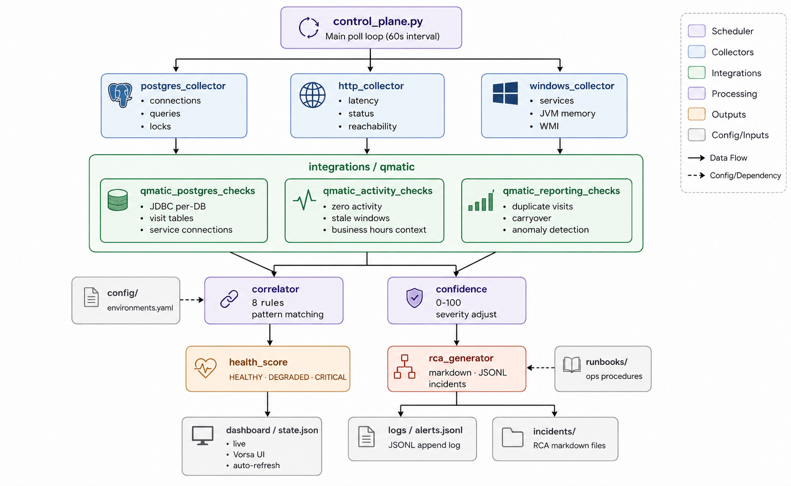

# Vorsa — Observability Control Plane

> **Your stack, under control.**

Operational intelligence and reliability platform for hosted Qmatic environments.
Detects degradation before customers report it. Correlates signals across PostgreSQL,
HTTP, Windows services, and Qmatic application activity. Generates RCA-style incident
summaries with confidence scoring and actionable remediation steps.

---



---

## What it does

- **Detects** PostgreSQL connection pressure, long-running queries, blocked locks
- **Monitors** HTTP endpoint availability and response latency
- **Tracks** Windows service state and JVM memory per Qmatic process
- **Measures** JDBC connections per database (qp_central, statdb, qp_agent, etc.)
- **Correlates** multi-signal failure patterns into named incidents
- **Scores** confidence 0–100 per incident based on signal strength and recurrence
- **Generates** RCA markdown files with evidence, likely cause, and recommended actions
- **Displays** a live operational dashboard (Vorsa UI)

---

## Architecture

```
control_plane.py                    ← main poll loop (60s)
│
├── collectors/
│   ├── postgres_collector.py       ← pg_stat_* system views
│   ├── http_collector.py           ← latency · status · reachability
│   └── windows_collector.py        ← WMI · services · JVM memory
│
├── integrations/qmatic/
│   ├── qmatic_postgres_checks.py   ← JDBC per-DB · service connections
│   ├── qmatic_activity_checks.py   ← zero activity · stale windows
│   └── qmatic_reporting_checks.py  ← duplicate visits · carryover
│
├── correlators/
│   ├── correlator.py               ← 8 correlation rules
│   ├── confidence.py               ← 0–100 scoring · severity adjustment
│   └── health_score.py             ← HEALTHY · DEGRADED · CRITICAL
│
├── rca/
│   └── rca_generator.py            ← markdown + JSONL incident output
│
├── config/
│   ├── environments.yaml           ← environment definitions
│   └── loader.py                   ← config loader + secret injection
│
├── dashboard/
│   ├── index.html                  ← Vorsa live dashboard
│   └── state.json                  ← written each poll cycle
│
├── runbooks/                       ← operational procedures
├── incidents/                      ← generated RCA files
└── logs/alerts.jsonl               ← JSONL alert log
```

---

## Quick start

```bash
pip install -r requirements.txt

# Set credentials as environment variables
export OBS_DB_PASSWORD_CXM_TEST_LOCAL=yourpassword
export OBS_WMI_USER_CXM_TEST_LOCAL=Administrator
export OBS_WMI_PASSWORD_CXM_TEST_LOCAL=yourpassword

# Single poll cycle (test)
python control_plane.py --once

# Continuous polling
python control_plane.py
```

Serve the dashboard:
```bash
python -m http.server 8888
# Open: http://localhost:8888/dashboard/index.html
```

---

## Configuration

All environments are defined in `config/environments.yaml`.

```yaml
environments:
  - name: cxm-test-local
    type: qmatic
    enabled: true
    timezone: America/Toronto

    business_hours:
      monday:    ["08:00", "18:00"]
      tuesday:   ["08:00", "18:00"]
      wednesday: ["08:00", "18:00"]
      thursday:  ["08:00", "18:00"]
      friday:    ["08:00", "18:00"]
      saturday:  []
      sunday:    []

    windows:
      host: 192.168.68.114
      username: Administrator

    postgres:
      host: 192.168.68.114
      port: 5432
      database: qp_app
      username: vorsa_readonly
      thresholds:
        connection_pct_warning:  75
        connection_pct_critical: 90
        long_query_seconds:      30
      monitored_databases:
        - qp_central
        - qp_app
        - qp_agent
        - qp_calendar
        - statdb

    http_checks:
      - name: qmatic-login
        url: http://192.168.68.114:8080/login.jsp
        expected_status: 200
        warning_latency_ms: 1500
        critical_latency_ms: 3000

    reporting_checks:
      enabled: false
```

**Secrets** are never stored in YAML. Set environment variables using the naming convention:
```
OBS_DB_PASSWORD_{ENV_NAME_UPPER_SNAKE}
OBS_WMI_USER_{ENV_NAME_UPPER_SNAKE}
OBS_WMI_PASSWORD_{ENV_NAME_UPPER_SNAKE}
```

To add a new environment — add a block to `environments.yaml`, set the env vars, restart.

---

## Correlation rules

| Rule | Signals | Severity |
|------|---------|----------|
| `db_unavailable` | PostgreSQL unreachable | critical |
| `db_saturation_api_cascade` | PG connections >75% + HTTP latency elevated | warning/critical |
| `zero_activity_business_hours` | Zero delivered visits during business hours | critical |
| `reporting_anomaly_with_db_pressure` | Duplicate visit IDs + long-running queries | warning |
| `service_stopped_db_drop` | Windows service stopped + JDBC connections dropped | critical |
| `memory_pressure_api_cascade` | JVM memory >60% of server RAM + API latency spike | warning |
| `silent_service_failure` | JDBC connections to DB dropped to 0, service running | warning |
| `app_layer_issue` | HTTP slow but DB healthy and services running | warning |

### Confidence scoring

Each incident receives a confidence score 0–100:

| Factor | Weight |
|--------|--------|
| Signal severity (critical/warning/ok) | 0–30 |
| Number of correlated signals | 0–25 |
| Signal recency (same poll cycle) | 0–20 |
| Historical recurrence (seen in last 24h) | 0–15 |
| Business hours context | 0–10 |

- **≥ 80% + critical pattern** → CRITICAL incident
- **50–79% + critical pattern** → downgraded to WARNING
- **< 50%** → suppressed (timeline only, no RCA file)

---

## Database permissions

```sql
-- PostgreSQL system health (postgres_collector)
GRANT pg_monitor TO vorsa_readonly;

-- Qmatic application tables (qmatic_postgres_checks)
GRANT SELECT ON visit TO vorsa_readonly;
GRANT SELECT ON scheduled_job TO vorsa_readonly;
GRANT SELECT ON branch TO vorsa_readonly;
GRANT SELECT ON service_point TO vorsa_readonly;
```

---

## Health score

The health score (0–100) is calculated from live signals each poll cycle:

| Condition | Penalty |
|-----------|---------|
| Active incident — critical (at 100% confidence) | −40 |
| Active incident — warning | −20 |
| Suppressed warning | −5 |
| PG connections > 90% | −20 |
| PG connections > 75% | −10 |
| HTTP unreachable | −25 |
| HTTP latency critical | −15 |
| Windows service stopped | −15 each |
| Server memory > 90% | −15 |
| Server memory > 80% | −8 |
| Long-running queries | −5 |
| Blocked queries | −10 |

Labels: **HEALTHY** (90–100) · **DEGRADED** (60–89) · **CRITICAL** (0–59)

---

## Runbooks

- [`runbooks/db-connection-exhaustion.md`](runbooks/db-connection-exhaustion.md)
- [`runbooks/zero-activity-business-hours.md`](runbooks/zero-activity-business-hours.md)

---

## Roadmap

**Next:**
- `statdb` schema mapping → activity and reporting checks
- Service memory thresholds alert (JVM heap > configurable %)
- API health endpoint discovery for Qmatic Orchestra

**Phase 3:**
- Slack / PagerDuty alerting integration
- Historical state trending (7-day connection pool, memory, latency)
- FastAPI backend to replace Python HTTP server

**Phase 4:**
- AI-assisted RCA narrative generation via Claude API
- Incident fingerprint matching against historical patterns
- Multi-environment aggregated health view

---

## Requirements

```
psycopg2-binary>=2.9
httpx>=0.27
pyyaml>=6.0
tzdata
```

Python 3.11+ required. Windows PowerShell required for WMI collection.
